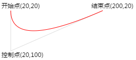
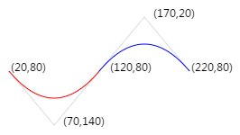
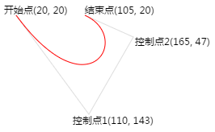
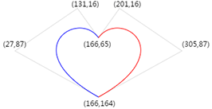

## HTML5 Canvas: 贝塞尔曲线

2017/06/23

### 背景资料

>[Bézier curve](https://en.wikipedia.org/wiki/B%C3%A9zier_curve) [De Casteljau's algorithm](https://en.wikipedia.org/wiki/De_Casteljau%27s_algorithm) [Bernstein polynomial](https://en.wikipedia.org/wiki/Bernstein_polynomial)

### HTML中的用法

#### 二次贝塞尔曲线

方法：quadraticCurveTo(cx, cy, x, y)

    moveTo(20, 20); // 开始点
    quadraticCurveTo(20, 100, 200, 20); // 控制点&结束点

简单应用：波浪线

    <canvas id="myCanvas" width="320" height="200"></canvas>
    

#### 三次贝塞尔曲线

方法：bezierCurveTo(cx1, cy1, cx2, cy2, x, y)

    moveTo(20, 20); // 开始点
    bezierCurveTo(110, 143, 165, 47, 105, 20); // 控制点1&控制点2&结束点

简单应用：心形

    <canvas id="myCanvas" width="320" height="200"></canvas>
    

#### 综合应用

采用CANVAS动画做一个通用loading页面。

[演示DEMO](./loading.html)
